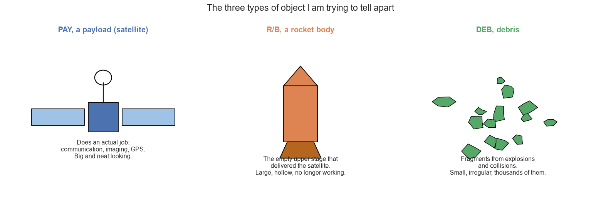
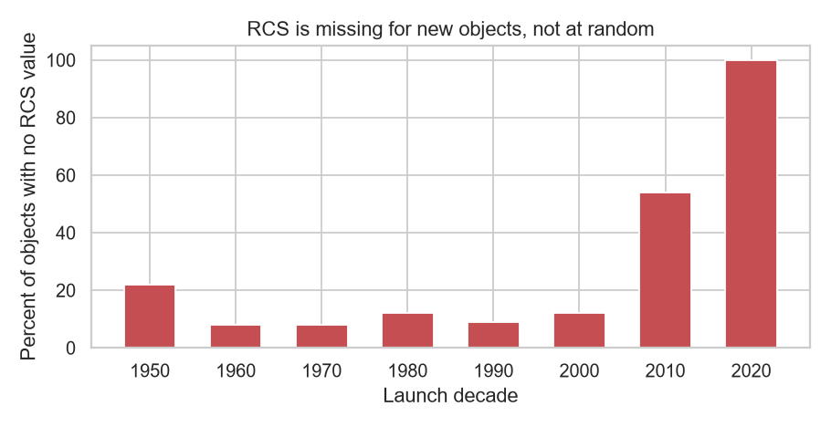
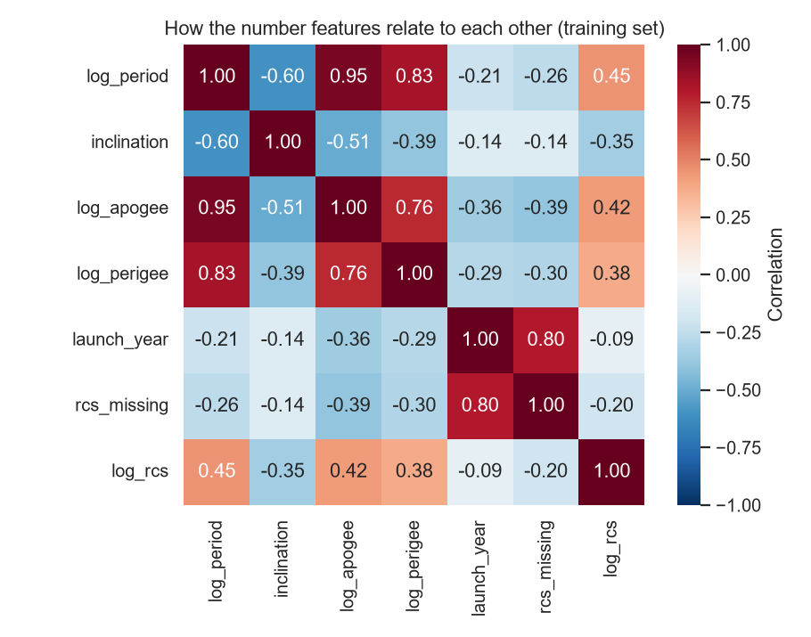
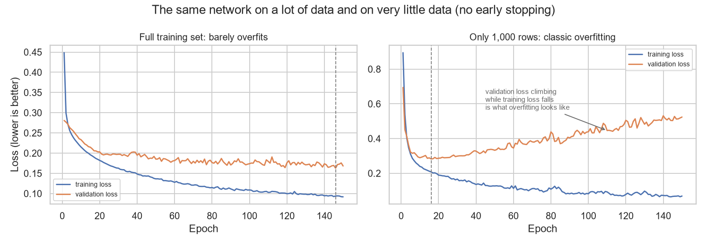
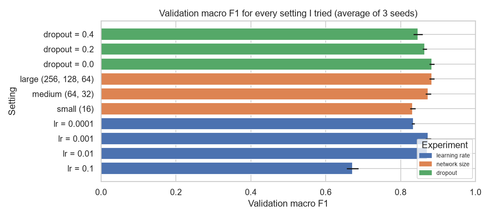

# US Space Force Object Classifier

Telling satellites, rocket bodies and space debris apart from orbit data alone, using a neural
network built with TensorFlow and Keras.



## The problem

About 35,000 man made objects are still going around the Earth right now. The US Space Force
tracks them and CelesTrak publishes the catalogue. Every object is one of three things:

* **PAY**, a payload. A satellite, working or dead.
* **R/B**, a rocket body. The empty upper stage that carried the satellite up.
* **DEB**, debris. Fragments from explosions and collisions.

**The question:** can a model work out which one it is looking at, using only the shape of the
orbit and a few facts about the launch? No names, no catalogue numbers, nothing that gives the
answer away.

This is not only a school exercise. Space agencies need to know how much junk is up there, and
when a new object is spotted somebody has to decide what it is. If orbit numbers alone are
enough, that decision can be automated.

## Results

Measured on a held out test set that the model saw exactly once, at the very end.

| Model | Accuracy | Macro F1 |
| --- | --- | --- |
| Always guess the most common class | 0.576 | 0.244 |
| Logistic regression | 0.898 | 0.744 |
| **Neural network** | **0.937** | **0.870** |

Macro F1 is the number that matters here, not accuracy. The classes are badly unbalanced, 58%
satellites against 6.5% rocket bodies, so accuracy rewards a model for ignoring the rare class.
Macro F1 gives all three classes equal weight and does not let that slide.


| Class | Precision | Recall | F1 |
| --- | --- | --- | --- |
| PAY, satellite | 0.985 | 0.922 | 0.952 |
| R/B, rocket body | 0.547 | 0.914 | 0.685 |
| DEB, debris | 0.983 | 0.965 | 0.974 |

Rocket bodies are the hard class and the confusion matrix shows why. The model finds 91% of the
real ones, but only about half of the things it labels R/B actually are one. That trade is
deliberate, it comes from the class weights. It is also physically reasonable: a rocket body is
the thing that carried the satellite up, so the two start out in very similar orbits.

## What I found

**Four columns had to be thrown away because they contain the answer.** `OBJECT_NAME` literally
has "DEB" or "R/B" written in it. `OPS_STATUS_CODE` is filled in for 93% of payloads and almost
nothing else. `OBJECT_ID` and `NORAD_CAT_ID` encode the launch and fragment numbering. Leaving
any of them in gives a 99% score that means nothing. Finding and removing them was the single
most important step in the project.

**Radar cross section is not missing at random.** It is missing for 100% of objects launched
since 2020 and almost none launched before 2010. It looks like "missing means satellite", but the
real driver is age, not type.



**Some features say the same thing twice.** Orbital period and apogee correlate at +0.95, which
is not a data quirk but Kepler's third law: how long an orbit takes is decided by how big it is.



**Dropout made the model worse, and the reason is interesting.** Training the network with early
stopping switched off shows it barely overfits on the full 24,000 training rows. Shrink the
training set to 1,000 rows and the textbook overfitting curve appears immediately. So on the real
data there was not much overfitting left for dropout to fix, and all it did was remove useful
capacity.



**More than half the satellites in orbit are Starlink.** Train without them and accuracy falls
from 0.936 to 0.919 while macro F1 barely moves. Thousands of near identical satellites make the
accuracy number look better than the model really is.

## Hyperparameter experiments

Every setting was run three times with different random seeds and averaged, so the spread between
seeds shows whether a difference is real or just luck. One thing changed at a time, all through
the same `build_model()` function.



| Experiment | Values tried | Result |
| --- | --- | --- |
| Learning rate | 0.1, 0.01, 0.001, 0.0001 | 0.1 is unstable and collapses to 0.67 macro F1. 0.0001 learns correctly but too slowly. The middle two win. |
| Network size | 16 / 64,32 / 256,128,64 | Biggest wins, but with a train to validation gap three times larger than the medium one. |
| Dropout | 0.0, 0.2, 0.4 | Made it worse at every level, see above. |
| Starlink in or out | with / without | Moves accuracy, barely moves macro F1. |

The honest summary: the gap between the worst sensible setting and the best is about 5 points of
macro F1. The gap between a broken setting and the rest is about 20. Getting hyperparameters into
the right range matters a lot, polishing inside that range matters much less than the data work
did.

## How it was built

| Step | Decision |
| --- | --- |
| Filtering | Keep only objects still in orbit with Earth as the orbit centre, drop unknown types. 70,793 rows down to 34,474. |
| Features | Period, inclination, apogee, perigee, radar cross section, launch year, owner, launch site. 31 columns after encoding. |
| Scaling | Log10 on period, apogee, perigee and RCS, because they span five orders of magnitude. Then standardised. |
| Categories | Owners and launch sites appearing fewer than 100 times in training grouped into OTHER, then one hot encoded. |
| Split | Stratified 70/15/15. The scaler, the RCS median and the category lists are all fitted on the training set only. |
| Imbalance | Balanced class weights, which lifted rocket body recall from 0.32 to 0.91. |
| Training | Adam, softmax output, early stopping on validation loss with patience 8. |

## Tech stack

Python 3.12, TensorFlow 2.21 and Keras 3.15 for the network, scikit learn 1.9 for preprocessing,
baselines and metrics, pandas, matplotlib and seaborn. Exact versions are pinned in
`requirements.txt`.

## Repository layout

```
.
├── data/            data README, source and download date (csv files not committed)
├── images/          charts exported from the notebook
├── notebooks/       space_object_classifier.ipynb, the full analysis
├── reports/         the notebook exported to HTML
├── scripts/         download_satcat.py
└── requirements.txt
```

## Running it

```bash
python -m venv .venv
.venv\Scripts\activate          # Windows
source .venv/bin/activate       # macOS or Linux

pip install -r requirements.txt
python scripts/download_satcat.py
jupyter lab notebooks/space_object_classifier.ipynb
```

A full run takes about 13 minutes on a laptop CPU, mostly the 39 training runs in the experiments.
Random seeds are fixed, so the numbers come out the same every time.

## Data

CelesTrak Satellite Catalog (SATCAT), downloaded 24 September 2026.

* Catalogue: https://celestrak.org/satcat/
* Raw CSV: https://celestrak.org/pub/satcat.csv
* Column documentation: https://celestrak.org/satcat/satcat-format.php

The CSV is not committed because it is large and changes daily. `scripts/download_satcat.py`
fetches a fresh copy and saves it with the date in the filename, so any result can be traced back
to the exact snapshot it came from. See [`data/README.md`](data/README.md).

## Known limitations

* The test set is a random slice of the same catalogue. Debris arrives in families, 2,313 pieces
  of my debris class come from a single 2007 anti satellite test, so fragments from one event can
  land in both train and test. A split by launch year would be a harder and fairer test.
* One snapshot in time. Launch patterns keep changing, so a model trained today would likely do
  worse on objects launched in five years.
* Rocket body precision of 0.55 is fine for surveying but annoying if a human has to check every
  alert.
* Gradient boosted trees would probably be competitive on tabular data like this. I did not try
  one because the assignment was about neural networks.

## Licence

MIT, see [LICENSE](LICENSE).
