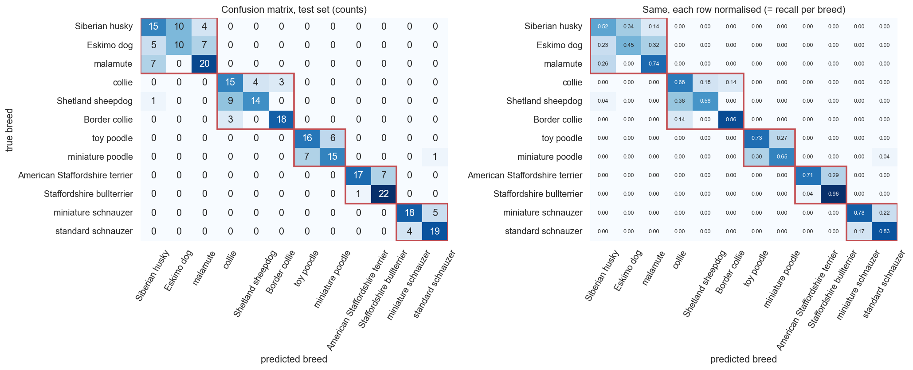
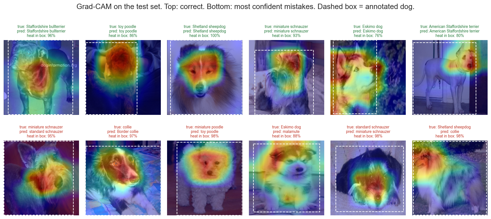

# Look-alike Dog Breed Classifier (transfer learning)

Telling confusable dog breeds apart with a pretrained CNN. MobileNetV2 with its ImageNet
weights is reused, the convolutional layers stay frozen, and only a small dense head is trained
on about 1,900 photos from the Stanford Dogs dataset.



## The problem

Breeds like Siberian husky, Eskimo dog and malamute look almost the same, and people (shelter
staff included) often label them wrong. **Can a pretrained image network, with untouched
convolutional layers, learn to separate breeds that look alike when only the dense layers are
trained?**

## What makes this version different

I do not train on all 120 breeds. In the notebook I measured that this is too easy: a plain
classifier on frozen MobileNetV2 features already gets **84.3% on all 120 breeds** without
training anything. So the data picks the subset: I found the breeds the network finds most
similar and confuses most, and kept **12 breeds in 5 look-alike groups** (northern spitz,
collies, poodles, bull terriers, schnauzers).

The dataset also has bounding boxes around every dog. I use them to test whether cropping to the
dog helps, and with Grad-CAM to measure whether the model looks at the dog or the background.

## Results

Test set of 283 photos, used once at the end.

| Model | Accuracy | Macro F1 |
| --- | --- | --- |
| Always guess the most common breed | 0.102 | 0.015 |
| Logistic regression on raw pixels | 0.131 | 0.128 |
| **Frozen MobileNetV2 + dense head (defaults)** | **0.703** | **0.707** |
| Final model (+ fine-tuning of the last 30 layers) | 0.703 | 0.706 |

* **98% of the mistakes are between breeds of the same look-alike group.** Husky, Eskimo dog and
  malamute are the worst. Poodles and schnauzers mostly differ in size, which a photo cannot show.
* **The tuning barely mattered.** Learning rate (except a too-large one), backbone
  (MobileNetV2, ResNet50, EfficientNetB0), augmentation and fine-tuning all moved the validation
  score by about 0.02 or less, so the plain frozen model is as good as the tuned one.
* **The dataset contains the same photo under two different breeds** (37 times in the whole
  dataset, 16 times in my subset, always between look-alikes). I removed those.
* **The model looks at the dog:** 77% of the Grad-CAM heat is inside the dog's box, which only
  covers 61% of the photo.



## Project layout

| Path | What it is |
| --- | --- |
| `notebooks/dog_lookalike_classifier.ipynb` | the report, with all outputs |
| `reports/dog_lookalike_classifier.html` | the same report exported to HTML (the hand-in file) |
| `scripts/download_stanford_dogs.py` | downloads and extracts the dataset |
| `data/README.md` | dataset source, layout and download date |
| `images/` | figures saved by the notebook |
| `requirements.txt` | pinned versions |

## Run it yourself

```bash
pip install -r requirements.txt
python scripts/download_stanford_dogs.py     # about 750 MB, extracts to data/
cd notebooks && jupyter nbconvert --to notebook --execute dog_lookalike_classifier.ipynb
```

It runs on a CPU. The first run takes about 30 minutes, mostly for the augmentation and
fine-tuning experiments. Features and images are cached in `data/cache/`, so later runs are
quicker. Seeds are fixed, but TensorFlow on different hardware can still give slightly different numbers.

## Limitations

The photos come from ImageNet, which MobileNetV2 was also trained on, so the scores are probably
optimistic for new photos. Mixed breeds are not covered. See section 10 of the notebook.
