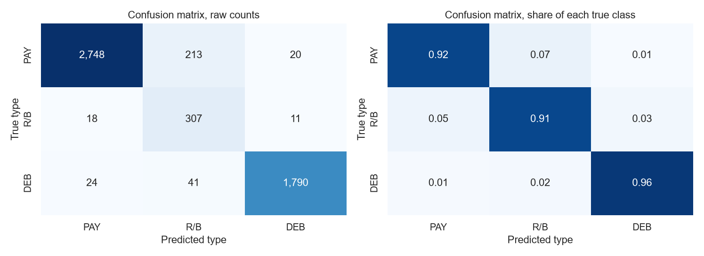

# Deep Learning Projects

Applied deep learning projects from my Fontys Applied AI semester. Every project is a complete,
reproducible research report: a clear question, exploratory analysis, baselines, controlled
experiments, evaluation on a held-out test set, and an honest discussion of what did and did not work.

| # | Project | Model | Data | Result |
| --- | --- | --- | --- | --- |
| 01 | [**US Space Force Object Classifier**](01-ann-space-object-classifier/) | Artificial neural network (Keras) | CelesTrak satellite catalogue, 35k orbiting objects (tabular) | 93.7% accuracy, 0.870 macro F1 on 3 imbalanced classes |
| 02 | [**Look-alike Dog Breed Classifier**](02-cnn-dog-lookalike-classifier/) | Transfer learning, frozen MobileNetV2 + dense head | Stanford Dogs, 12 hard breeds (images) | 70.3% accuracy, 0.706 macro F1 on 12 look-alike breeds |

## 01. Classifying objects in Earth orbit (ANN)

Can a neural network tell satellites, rocket bodies and debris apart from orbit numbers alone?

* Found and removed four columns that leak the answer, which is the difference between a
  meaningful 94% and a meaningless 99%.
* Handled 58% / 6.5% class imbalance with class weights and judged the models on macro F1, not accuracy.
* Tested learning rate, network size and dropout over several seeds, and checked how much
  the result depends on one satellite constellation (Starlink).

[](01-ann-space-object-classifier/)

[Project README](01-ann-space-object-classifier/README.md) · [Full report (HTML)](01-ann-space-object-classifier/reports/space_object_classifier.html) · [Notebook](01-ann-space-object-classifier/notebooks/space_object_classifier.ipynb)

## 02. Telling look-alike dog breeds apart (CNN, transfer learning)

Can a pretrained CNN with untouched convolutional layers learn to separate breeds that look almost
the same, when only a small dense head is trained?

* Showed that the standard task (all 120 breeds) is too easy, 84% with nothing trained, then let the
  data choose the hard subset instead of picking breeds by taste.
* Found the same photo filed under two different breeds in the dataset, and removed those conflicts
  before splitting, so the evaluation is fair.
* Compared backbones, cropping, augmentation and fine-tuning, and reported honestly that tuning
  changed the score by only about 0.02.
* Used the dataset's bounding boxes with Grad-CAM to measure that the model looks at the dog, not the background.

[](02-cnn-dog-lookalike-classifier/)

[Project README](02-cnn-dog-lookalike-classifier/README.md) · [Full report (HTML)](02-cnn-dog-lookalike-classifier/reports/dog_lookalike_classifier.html) · [Notebook](02-cnn-dog-lookalike-classifier/notebooks/dog_lookalike_classifier.ipynb)

## Repository layout

```
01-ann-space-object-classifier/     notebook, report, scripts, data docs, pinned requirements
02-cnn-dog-lookalike-classifier/    notebook, report, scripts, data docs, pinned requirements
```

Each project folder is self-contained. Run its commands from inside that folder. The raw datasets
are not committed, every project has a `scripts/` download script and a `data/README.md` that
explains where the data comes from.

## Tools

Python · TensorFlow / Keras · scikit-learn · pandas · NumPy · matplotlib / seaborn · Jupyter

## Author

Josif Mitsanski, Fontys University of Applied Sciences. Code is MIT licensed, see [LICENSE](LICENSE).
